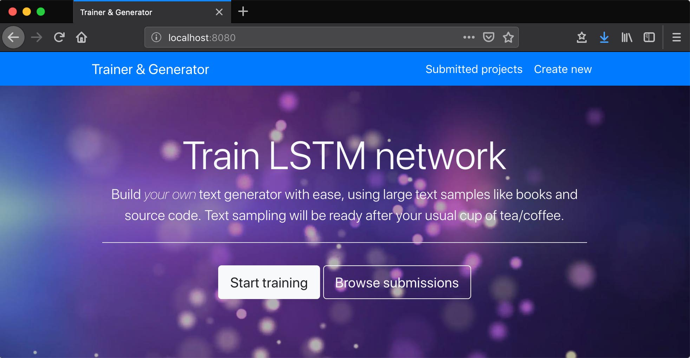

# Char-RNN-TensorFlow

[](https://travis-ci.org/ivarprudnikov/char-rnn-tensorflow)
[](https://github.com/ivarprudnikov/char-rnn-tensorflow/issues)
[](https://github.com/ivarprudnikov/char-rnn-tensorflow/commits/master)

**Blog post explaining it all** [Run Tensorflow scripts from Node.js server deployed on AWS as Docker container](https://www.ivarprudnikov.com/run-tensorflow-scripts-nodejs-server-deployed-aws-docker-container/)

Character generator using recurrent neural network (_RNN_).
Also _Node.js_ server used to provide _HTTP_ API for training 
_RNN_ and then generating samples from saved checkpoints.



## Generator

_Forked_ from [hzy46/Char-RNN-TensorFlow](https://github.com/hzy46/Char-RNN-TensorFlow) 
and is in separate directory (`generator/`) now to avoid confusion. It has its own documentation
in [`generator/README.md`](generator/README.md).

## Server

Trivial _Node.js_ server used to store incoming training data and call `python` scripts to train 
and generate text. Read about it in [`server/README.md`](server/README.md)

## Development

Both `server` and `generator` are expected to run in Docker  
and running image locally would replicate production environment.
You could also run server directly but then need to be sure that all
python dependencies are installed locally. 

You will need to have MySQL database running with the schema provided in [mysql_setup/](./mysql_setup) 

### a) Build and run Docker image

**Via prepared script**

```shell script
$ ./runDockerImage.sh
```

**Manually**

- To `build` container image: `docker build -t <some_name> .`
- To `run` above image: 
```shell script
docker run --rm -ti \
    -e "MYSQL_HOST=docker.for.mac.localhost" \
    -e "MYSQL_USER=root" \
    -e "MYSQL_PASSWORD=" \
    -e "MYSQL_DATABASE=rnn_generator" \
    -p 8080:8080 <some_name>
```

**Tip:** If you want to keep trained models and uploads between runs then map local volume/directory when starting Docker container:

```shell script
docker run --rm -ti \
    -v /change/location/models:/app/generator/model \ 
    -v /change/location/uploads:/app/server/uploads \
    -p 8080:8080 <some_name>
```

### b) Run using virtualenv

*New virtualenv*

- Create new environment in dir `venv` - `$ virtualenv -p python3 venv`
- Activate environment - `$ source venv/bin/activate`
- Install dependencies - `(venv) $ pip install -r requirements.txt`

*Existing virtualenv*

- Activate environment - `$ source venv/bin/activate`
- Use _Node.js_ `v10` `(venv) $ nvm use 10`
- `run` server `(venv) $ node server/server`

## GPU support

This example does not have Tensorflow with GPU support. If you want to use GPU do one of the following:
- change Tensorflow dependency in [generator/requirements.txt](./generator/requirements.txt) to the one that supports GPU, ie: `tensorflow-gpu==1.14`
- change base [Docker image](./Dockerfile) to include Tensorflow with GPU:
```dockerfile
FROM tensorflow/tensorflow:1.14.0-gpu-py3
```

## AWS deployment

Deployment to AWS was removed in commit https://github.com/ivarprudnikov/char-rnn-tensorflow/commit/040a93a46e674bb6be71d6cbe1b199142f98d19f

## Your feedback

You are free to open issues if there is anything bothering you.
